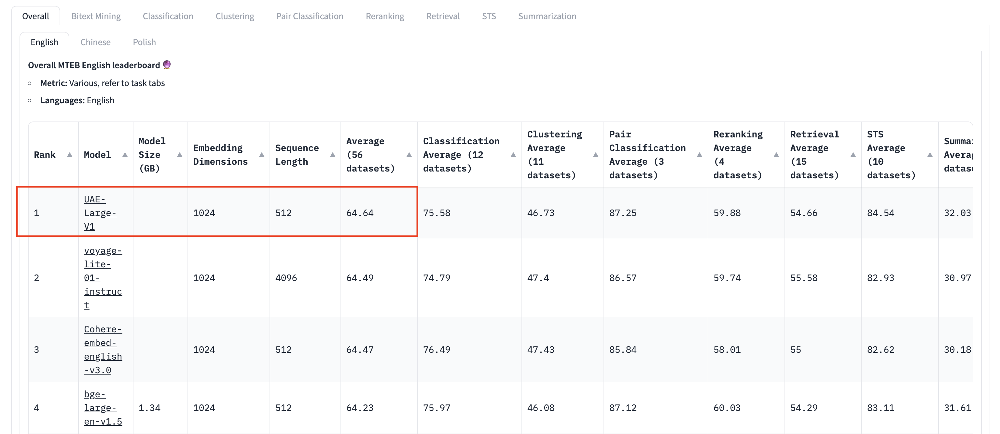
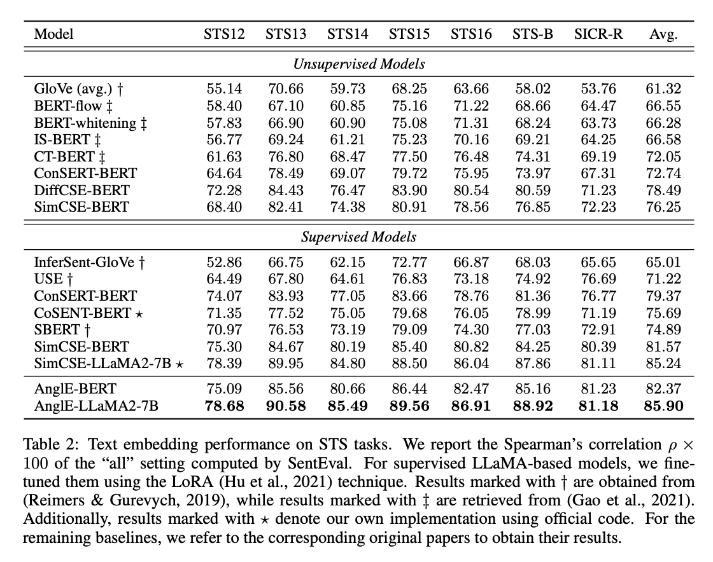

<small>EN | [简体中文](README_zh.md) </small>

# [AnglE📐: Angle-optimized Text Embeddings](https://arxiv.org/abs/2309.12871)

> It is Angle 📐, not Angel 👼.

🔥 **A New SOTA** for Semantic Textual Similarity! 


🔥 **Our universal sentence embedding [WhereIsAI/UAE-Large-V1](https://huggingface.co/WhereIsAI/UAE-Large-V1) achieves SOTA on the [MTEB Leaderboard](https://huggingface.co/spaces/mteb/leaderboard) with an average score of 64.64!**


<a href="https://arxiv.org/abs/2309.12871">
    
</a>
<a href="https://pypi.org/project/angle_emb/">
    
</a>
<a href="https://pypi.org/project/angle_emb/">
    
</a>
<a href="http://makeapullrequest.com">
    
</a>

[](https://paperswithcode.com/sota/semantic-textual-similarity-on-sick-r-1?p=angle-optimized-text-embeddings)
[](https://paperswithcode.com/sota/semantic-textual-similarity-on-sts16?p=angle-optimized-text-embeddings)
[](https://paperswithcode.com/sota/semantic-textual-similarity-on-sts15?p=angle-optimized-text-embeddings)
[](https://paperswithcode.com/sota/semantic-textual-similarity-on-sts14?p=angle-optimized-text-embeddings)
[](https://paperswithcode.com/sota/semantic-textual-similarity-on-sts13?p=angle-optimized-text-embeddings)
[](https://paperswithcode.com/sota/semantic-textual-similarity-on-sts12?p=angle-optimized-text-embeddings)
[](https://paperswithcode.com/sota/semantic-textual-similarity-on-sts-benchmark?p=angle-optimized-text-embeddings)


<details>
<summary>📊 Results on MTEB Leaderboard [click to expand]</summary>
<p align='center'>

</p>
</details>

<details>
<summary>📊 Results on STS benchmark [click to expand]</summary>
<p align='center'>

</p>
</details>

## 🤗 Pretrained Models
| 🤗 HF | LoRA Weight | Dependent Backbone | LLM | Language | Prompt | Pooling Strategy | Examples |
|----|------|------|------|------|------|------|------|
| [WhereIsAI/UAE-Large-V1](https://huggingface.co/WhereIsAI/UAE-Large-V1) |  N | N | N | EN | `Prompts.C` for retrieval purposes, `None` for others | cls | [](https://colab.research.google.com/drive/1WOYD6f8gb_wpkUm_57K8pEDgjlGJd6oB?usp=drive_link) |
| [SeanLee97/angle-llama-13b-nli](https://huggingface.co/SeanLee97/angle-llama-13b-nli) | Y |  NousResearch/Llama-2-13b-hf | Y | EN | `Prompts.A` | last token | / | 
| [SeanLee97/angle-llama-7b-nli-v2](https://huggingface.co/SeanLee97/angle-llama-7b-nli-v2) | Y |  NousResearch/Llama-2-7b-hf | Y | EN | `Prompts.A` | last token | / |
| [SeanLee97/angle-llama-7b-nli-20231027](https://huggingface.co/SeanLee97/angle-llama-7b-nli-20231027) | Y |  NousResearch/Llama-2-7b-hf | Y | EN | `Prompts.A` | last token | / |
| [SeanLee97/angle-bert-base-uncased-nli-en-v1](https://huggingface.co/SeanLee97/angle-bert-base-uncased-nli-en-v1) | N |  N | N | EN | N | `cls_avg` | / |
| [SeanLee97/angle-roberta-wwm-base-zhnli-v1](https://huggingface.co/SeanLee97/angle-roberta-wwm-base-zhnli-v1) | N |  N | N | ZH-CN | N | `cls` | / |
| [SeanLee97/angle-llama-7b-zhnli-v1](https://huggingface.co/SeanLee97/angle-llama-7b-zhnli-v1) | Y |  NousResearch/Llama-2-7b-hf | Y | ZH-CN | `Prompts.B` | last token | / |
 
💡 If the selected model is a LoRA weight, it must specify the corresponding dependent backbone.

For our STS Experiment, please refer to https://github.com/SeanLee97/AnglE/tree/main/examples/NLI

</details>

## Results

### English STS Results

| Model | STS12 | STS13 | STS14 | STS15 | STS16 | STSBenchmark | SICKRelatedness |  Avg. |
| ------- |-------|-------|-------|-------|-------|--------------|-----------------|-------|
| [SeanLee97/angle-llama-7b-nli-20231027](https://huggingface.co/SeanLee97/angle-llama-7b-nli-20231027) | 78.68 | 90.58 | 85.49 | 89.56 | 86.91 |    88.92     |      81.18      | 85.90 |
| [SeanLee97/angle-llama-7b-nli-v2](https://huggingface.co/SeanLee97/angle-llama-7b-nli-v2) | 79.00 | 90.56 | 85.79 | 89.43 | 87.00 |    88.97     |      80.94      | 85.96 |
| [SeanLee97/angle-llama-13b-nli](https://huggingface.co/SeanLee97/angle-llama-13b-nli)  | 79.33 | 90.65 | 86.89 | 90.45 | 87.32 |    89.69     |      81.32       | **86.52** |
| [SeanLee97/angle-bert-base-uncased-nli-en-v1](https://huggingface.co/SeanLee97/angle-bert-base-uncased-nli-en-v1) | 75.09 | 85.56 | 80.66 | 86.44 | 82.47 | 85.16 | 81.23 | 82.37 |


### Chinese STS Results

| Model | ATEC | BQ	| LCQMC | PAWSX | STS-B | SOHU-dd | SOHU-dc | Avg. |
| ------- |-------|-------|-------|-------|-------|--------------|-----------------|-------|
| ^[shibing624/text2vec-bge-large-chinese](https://huggingface.co/shibing624/text2vec-bge-large-chinese) | 38.41 | 61.34 | 71.72 | 35.15 | 76.44 | 71.81 | 63.15 | 59.72 |
| ^[shibing624/text2vec-base-chinese-paraphrase](https://huggingface.co/shibing624/text2vec-base-chinese-paraphrase) |	44.89 | 63.58 | 74.24 | 40.90 | 78.93 | 76.70 | 63.30 | 63.08 |
| [SeanLee97/angle-roberta-wwm-base-zhnli-v1](https://huggingface.co/SeanLee97/angle-roberta-wwm-base-zhnli-v1) | 49.49 | 72.47 | 78.33 | 59.13 | 77.14 |    72.36     |      60.53      | **67.06** |
| [SeanLee97/angle-llama-7b-zhnli-v1](https://huggingface.co/SeanLee97/angle-llama-7b-zhnli-v1) | 50.44 | 71.95 | 78.90 | 56.57 | 81.11 | 68.11 | 52.02 | 65.59 |

^ denotes baselines, their results are retrieved from: https://github.com/shibing624/text2vec


## Usage

AnglE supports two APIs, one is the `transformers` API, the other is the `AnglE` API. If you want to use the `AnglE` API, please install AnglE first:

```bash
python -m pip install -U angle-emb
```

### UAE

1) For Retrieval Purposes

For retrieval purposes, please use the prompt `Prompts.C`.

```python
from angle_emb import AnglE, Prompts

angle = AnglE.from_pretrained('WhereIsAI/UAE-Large-V1', pooling_strategy='cls').cuda()
angle.set_prompt(prompt=Prompts.C)
vec = angle.encode({'text': 'hello world'}, to_numpy=True)
print(vec)
vecs = angle.encode([{'text': 'hello world1'}, {'text': 'hello world2'}], to_numpy=True)
print(vecs)
```

2) For non-Retrieval Purposes

```python
from angle_emb import AnglE

angle = AnglE.from_pretrained('WhereIsAI/UAE-Large-V1', pooling_strategy='cls').cuda()
vec = angle.encode('hello world', to_numpy=True)
print(vec)
vecs = angle.encode(['hello world1', 'hello world2'], to_numpy=True)
print(vecs)
```

<details>
<summary>Difference between retrieval and non-retrieval sentence embeddings. [click to expand]</summary>

In UAE, we use different approaches for retrieval and non-retrieval tasks, each serving a different purpose. 

**Retrieval tasks aim to find relevant documents, and as a result, the related documents may not have strict semantic similarities to each other.**

For instance, when querying "How about ChatGPT?", the related documents are those that contain information related to "ChatGPT," such as "ChatGPT is amazing..." or "ChatGPT is bad....".

Conversely, **non-retrieval tasks, such as semantic textual similarity, require sentences that are semantically similar.**

For example, a sentence semantically similar to "How about ChatGPT?" could be "What is your opinion about ChatGPT?".

To distinguish between these two types of tasks, we use different prompts. 

For retrieval tasks, we use the prompt "Represent this sentence for searching relevant passages: {text}" (Prompts.C in angle_emb). 

For non-retrieval tasks, we set the prompt to empty, i.e., just input your text without specifying a prompt.

So, if your scenario is retrieval-related, it is highly recommended to set the prompt with angle.set_prompt(prompt=Prompts.C). If not, leave the prompt empty or use angle.set_prompt(prompt=None).
</details>

### Angle-LLaMA

1) AnglE
```python
from angle_emb import AnglE, Prompts

angle = AnglE.from_pretrained('NousResearch/Llama-2-7b-hf', pretrained_lora_path='SeanLee97/angle-llama-7b-nli-v2')

print('All predefined prompts:', Prompts.list_prompts())
angle.set_prompt(prompt=Prompts.A)
print('prompt:', angle.prompt)
vec = angle.encode({'text': 'hello world'}, to_numpy=True)
print(vec)
vecs = angle.encode([{'text': 'hello world1'}, {'text': 'hello world2'}], to_numpy=True)
print(vecs)
```

2) transformers

```python
from angle_emb import AnglE
from transformers import AutoModelForCausalLM, AutoTokenizer
from peft import PeftModel, PeftConfig

peft_model_id = 'SeanLee97/angle-llama-7b-nli-v2'
config = PeftConfig.from_pretrained(peft_model_id)
tokenizer = AutoTokenizer.from_pretrained(config.base_model_name_or_path)
model = AutoModelForCausalLM.from_pretrained(config.base_model_name_or_path).bfloat16().cuda()
model = PeftModel.from_pretrained(model, peft_model_id).cuda()

def decorate_text(text: str):
    return Prompts.A.format(text=text)

inputs = 'hello world!'
tok = tokenizer([decorate_text(inputs)], return_tensors='pt')
for k, v in tok.items():
    tok[k] = v.cuda()
vec = model(output_hidden_states=True, **tok).hidden_states[-1][:, -1].float().detach().cpu().numpy()
print(vec)
```

### Angle-BERT

1) AnglE
```python
from angle_emb import AnglE

angle = AnglE.from_pretrained('SeanLee97/angle-bert-base-uncased-nli-en-v1', pooling_strategy='cls_avg').cuda()
vec = angle.encode('hello world', to_numpy=True)
print(vec)
vecs = angle.encode(['hello world1', 'hello world2'], to_numpy=True)
print(vecs)
```

2) transformers

```python
import torch
from transformers import AutoModel, AutoTokenizer

model_id = 'SeanLee97/angle-bert-base-uncased-nli-en-v1'
tokenizer = AutoTokenizer.from_pretrained(model_id)
model = AutoModel.from_pretrained(model_id).cuda()

inputs = 'hello world!'
tok = tokenizer([inputs], return_tensors='pt')
for k, v in tok.items():
    tok[k] = v.cuda()
hidden_state = model(**tok).last_hidden_state
vec = (hidden_state[:, 0] + torch.mean(hidden_state, dim=1)) / 2.0
print(vec)
```

## Custom Train

### 1. Data Prepation

We support two dataset formats:

1) `DatasetFormats.A`: it is a pair format with three columns: `text1`, `text2`, and `label` (0/1).

2) `DatasetFormats.B`: it is a triple format with three columns: `text`, `positive`, and `negative`. `positive` and `negative` store the positive and negative samples of `text`.

You need to prepare your data into huggingface `datasets.Dataset` in one of the formats in terms of your supervised data.

### 2. Train

Use `angle-trainer` to train your AnglE model in cli mode. Usage: `CUDA_VISIBLE_DEVICES=0 angle-trainer --help`


### 3. Example

[](https://colab.research.google.com/drive/1h28jHvv_x-0fZ0tItIMjf8rJGp3GcO5V?usp=sharing)


```python
from datasets import load_dataset
from angle_emb import AnglE, AngleDataTokenizer


# 1. load pretrained model
angle = AnglE.from_pretrained('SeanLee97/angle-bert-base-uncased-nli-en-v1', max_length=128, pooling_strategy='cls').cuda()

# 2. load dataset
# `text1`, `text2`, and `label` are three required columns.
ds = load_dataset('mteb/stsbenchmark-sts')
ds = ds.map(lambda obj: {"text1": str(obj["sentence1"]), "text2": str(obj['sentence2']), "label": obj['score']})
ds = ds.select_columns(["text1", "text2", "label"])

# 3. transform data
train_ds = ds['train'].shuffle().map(AngleDataTokenizer(angle.tokenizer, angle.max_length), num_proc=8)
valid_ds = ds['validation'].map(AngleDataTokenizer(angle.tokenizer, angle.max_length), num_proc=8)
test_ds = ds['test'].map(AngleDataTokenizer(angle.tokenizer, angle.max_length), num_proc=8)

# 4. fit
angle.fit(
    train_ds=train_ds,
    valid_ds=valid_ds,
    output_dir='ckpts/sts-b',
    batch_size=32,
    epochs=5,
    learning_rate=2e-5,
    save_steps=100,
    eval_steps=1000,
    warmup_steps=0,
    gradient_accumulation_steps=1,
    loss_kwargs={
        'w1': 1.0,
        'w2': 1.0,
        'w3': 1.0,
        'cosine_tau': 20,
        'ibn_tau': 20,
        'angle_tau': 1.0
    },
    fp16=True,
    logging_steps=100
)

# 5. evaluate
corrcoef, accuracy = angle.evaluate(test_ds, device=angle.device)
print('corrcoef:', corrcoef)
```

# Citation

You are welcome to use our code and pre-trained models. If you use our code and pre-trained models, please support us by citing our work as follows:

```bibtex
@article{li2023angle,
  title={AnglE-optimized Text Embeddings},
  author={Li, Xianming and Li, Jing},
  journal={arXiv preprint arXiv:2309.12871},
  year={2023}
}
```

# ChangeLogs

| 📅 | Description |
|----|------|
| 2024 Jan 11 |  refactor to support `angle-trainer` and BeLLM  |
| 2023 Dec 4 |  Release a universal English sentence embedding model: [WhereIsAI/UAE-Large-V1](https://huggingface.co/WhereIsAI/UAE-Large-V1)  |
| 2023 Nov 2 |  Release an English pretrained model: `SeanLee97/angle-llama-13b-nli` |
| 2023 Oct 28 |  Release two chinese pretrained models: `SeanLee97/angle-roberta-wwm-base-zhnli-v1` and `SeanLee97/angle-llama-7b-zhnli-v1`; Add chinese README.md |
